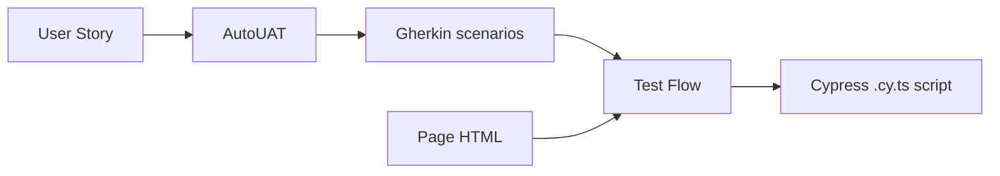

# Acceptance Test Generation with Large Language Models

Python implementation of the two-step approach from the paper
**"Acceptance Test Generation with Large Language Models: An Industrial Case Study"**
(Ferreira, Viegas, Faria, Lima — arXiv:2504.07244).



## Pipeline

| Step | Tool | Transform | Output |
|------|------|-----------|--------|
| 1 | **AutoUAT** | User Story → acceptance test scenarios | Gherkin |
| 2 | **Test Flow** | Gherkin + HTML → executable test script | Cypress (TypeScript) |

Both tools use an LLM via the **OpenAI API** (default model `gpt-4o-mini`).

## Prerequisites

- Python 3.10+
- (Optional) Node.js on `PATH` with `@typescript-eslint/parser` installed
  (`npm i -D @typescript-eslint/parser`) for strong TypeScript syntax validation.
  Without it, a lightweight bracket/quote heuristic is used.

## Installation

```powershell
cd d:\APCS\Acceptance
.\.venv\Scripts\python.exe -m pip install -r requirements.txt
```

Copy `.env.example` to `.env` and fill in your **OpenAI API key** (and, if
needed, JIRA) credentials.

## CLI usage

AutoUAT — User Story → Gherkin:
```powershell
.\.venv\Scripts\python.exe cli.py autouat --title "Alphabet User Sign-Up" --file story.txt
```

Test Flow — Gherkin + HTML → Cypress:
```powershell
.\.venv\Scripts\python.exe cli.py testflow --story-file story.txt --gherkin-file scenarios.feature --html-file page.html
```

Test Flow directly from JIRA:
```powershell
.\.venv\Scripts\python.exe cli.py testflow-issue --issue-key PROJ-123 --url https://example.com/page
```

iTrust2 (auto-detects a local clone under `d:\APCS\iTrust2` / `ITRUST2_REPO`, else fetches from GitHub):
```powershell
.\.venv\Scripts\python.exe cli.py itrust2 list
.\.venv\Scripts\python.exe cli.py itrust2 autouat --feature AddHospital
.\.venv\Scripts\python.exe cli.py itrust2 testflow --feature AddHospital
# Most faithful to the paper: capture the REAL rendered HTML of a running app.
# Set ITRUST2_USERNAME / ITRUST2_PASSWORD (in .env) to log in to protected pages.
.\.venv\Scripts\python.exe cli.py itrust2 testflow --feature AddHospital --page-url http://localhost:8080/iTrust2/admin/hospitals
.\.venv\Scripts\python.exe cli.py itrust2 testflow --feature AddHospital --repo d:\APCS\iTrust2
```

Serve the REST API:
```powershell
.\.venv\Scripts\python.exe cli.py serve --port 5000
```

## REST API

| Method | Endpoint | Purpose |
|--------|----------|---------|
| GET | `/health` | Health check |
| POST | `/autouat/generate` | `{title, description}` → `{gherkin, scenarios}` |
| POST | `/testflow/generate` | `{user_story, gherkin_scenarios, html}` → `{script}` |
| POST | `/testflow/generate-from-issue` | `{issue_key, urls}` → `{script}` |

Example:
```powershell
curl -X POST http://127.0.0.1:5000/autouat/generate -H "Content-Type: application/json" -d "{\"title\":\"Sign up\",\"description\":\"As a user I want to sign up.\"}"
```

## Package layout

```
atg/
├── config.py          # Env-based settings (OpenAI, JIRA)
├── models.py          # Dataclasses (UserStory, GherkinScenario, TestFlowInput/Result)
├── llm_client.py      # OpenAI chat completions client (gpt-4o-mini)
├── prompts.py         # Prompt templates (Appendix A & B)
├── autouat.py         # Step 1 + Gherkin parser
├── testflow.py        # Step 2
├── html_fetcher.py    # Fetch + strip <style>/<script>
├── jira_extractor.py  # JIRA issue -> UserStory + Gherkin
├── itrust2.py         # iTrust2 adapter (features + HTML from GitHub)
├── code_extractor.py  # Extract code block from LLM response
├── ts_validate.py     # TypeScript syntax validation
└── api.py             # Flask REST API
```

## Tests

```powershell
.\.venv\Scripts\python.exe -m pip install pytest
.\.venv\Scripts\python.exe -m pytest tests -q
```

## Security note

Your OpenAI API key is read from `.env` and is sent only to the OpenAI API.
Generated test scripts **must be reviewed by developers** before being
committed/run — LLM output cannot be blindly trusted.
